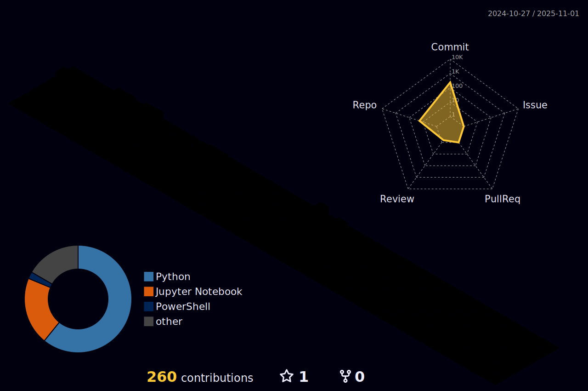

<!-- Title Section -->
<h1 align="center">
  
</h1>

<!-- Profile Views Counter -->

  

<!-- About Me Section -->
<h2 align="center">About Me 🚀</h2>

  🌱 I'm passionate about Data Engineering and Cloud Technologies 
  💡 I specialize in building scalable data solutions and cloud infrastructure 
  🯠Goals: Innovate in the field of Data Engineering and Cloud Architecture 
  ⚡ Fun fact: I love turning complex data challenges into elegant solutions

<!-- Tech Stack Section -->
<h2 align="center">Tech Stack 💻</h2>

<!-- Programming Languages -->
<h3 align="center">Programming Languages</h3>

  

<!-- Cloud & DevOps -->
<h3 align="center">Cloud & DevOps</h3>

   
  

<!-- Databases -->
<h3 align="center">Databases & Data Tools</h3>

  

<!-- Additional Skills -->
<h3 align="center">Specialized Tools & Technologies</h3>

  
  
  
  
  

<!-- Expertise Areas -->
<h3 align="center">Areas of Expertise</h3>

  ⚡ Data Engineering & ETL Pipelines 
  📊 Data Warehousing & Modeling 
  🔄 CI/CD & Infrastructure as Code 
  📈 Business Analytics & KPIs 
  🛡️ High Availability & Disaster Recovery 
  📱 Data Visualization & Reporting

<!-- GitHub Stats Section -->
<h2 align="center">GitHub Stats 📊</h2>

  
  

<!-- Most Used Languages -->

  

<!-- 3D Contribution Calendar -->
<h2 align="center">Contributions 📈</h2>
 

  

<!-- Recent Activity -->
<h2 align="center">Recent Activity ⚡</h2>

<!--START_SECTION:activity-->
<!--END_SECTION:activity-->

<!-- GitHub Trophies -->

  

<!-- Connect With Me -->
<h2 align="center">Connect With Me 🤝</h2>

  

<!-- Snake Animation -->

   <picture>
    <source media="(prefers-color-scheme: dark)" srcset="https://raw.githubusercontent.com/BairiRohithReddy/BairiRohithReddy/output/github-contribution-grid-snake-dark.svg" />
    <source media="(prefers-color-scheme: light)" srcset="https://raw.githubusercontent.com/BairiRohithReddy/BairiRohithReddy/output/github-contribution-grid-snake.svg" />
    
  </picture>
 

<!-- Footer -->
<h3 align="center">
  Thanks for visiting! 
</h3>
